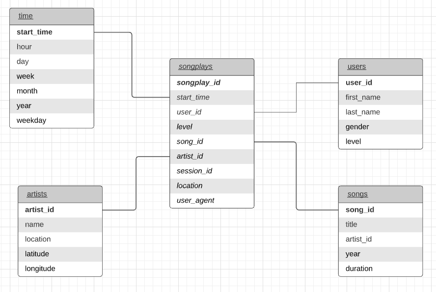

# AWS DWH Project

### Objective
A cloud based Data warehouse is needed to analyze data relating to songs and user activity generated from a new music streaming app released by a startup. \
Data is extracted from JSON logs generated from user activity which also store metadata about songs. JSON logs are located in S3\
In doing so, an ETL pipeline is setup in order to extract the data from S3, staging it in Redshift and then creating dimension and fact tables readily available for quick queries. 

### Schema and ETL
The final tables are organized following a star schema where **songplays** table is the fact table and stores data about user activity collected from the logs.\
The dimension tables represent data about users (name, gender etc..), songs (title, artist etc..) and artists(name, location..). There's also a "time" table which enable to discriminate between different periods of time quickly in our queries.\
The ETL pipeline is built using python and its libraries for data modelling and communication with Redshift. It takes as input the JSON documents relating logs and metadata, stages the extracted data in two main tables and then, through SQL queries, it creates the tables and inserts values as it reads/prepares sequentially every document. 

### Repo
Here are present:
* create_tables.py : run first to drop and recreate tables. 
* etl.ipynb : run after create_tables. It stages and fills tables.
* sql_queries.py : actual queries used in Redshift, passed as arguments in create_tables.py and etl.py
* dwh.cfg : contains data about the Redshift cluster, IAM roles and S3 paths. To be filled with relevant data.

### Use
Fill dwh.cfg with all the relevant data to access AWS and Redshift cluster. 
Before running etl.py, run create_tables.py in order to create the relevant tables.\
create_tables.py imports objects from sql_queries.py, check also that out for changes or errors.\
Only then run etl.py to fill the tables with the actual data. 
