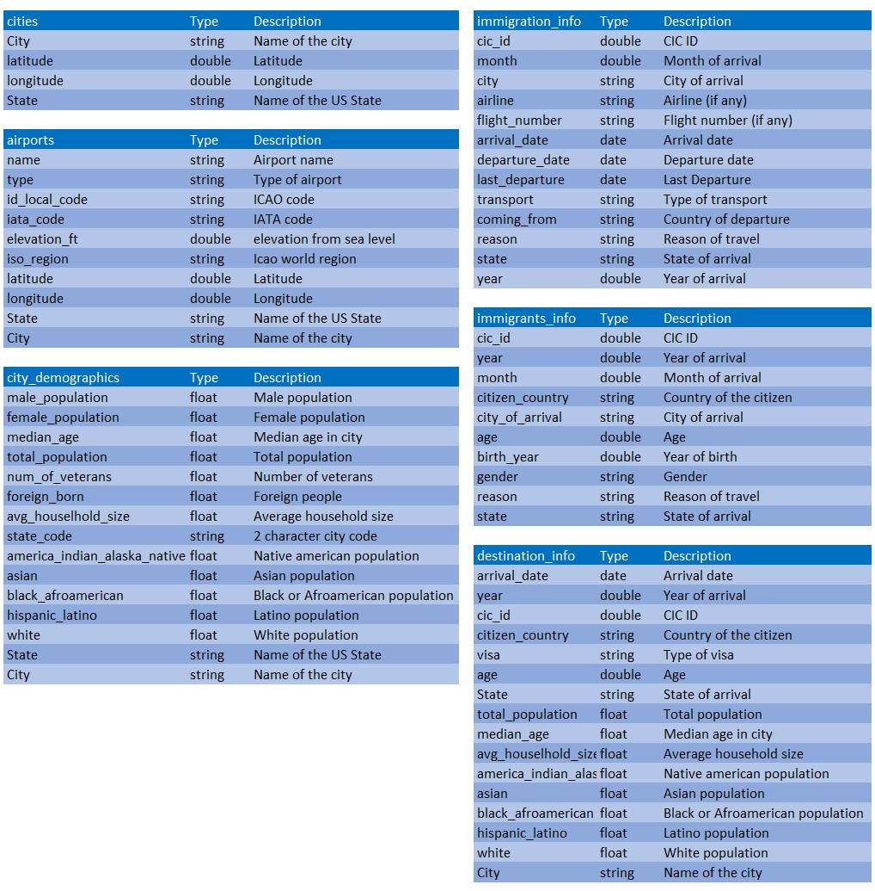
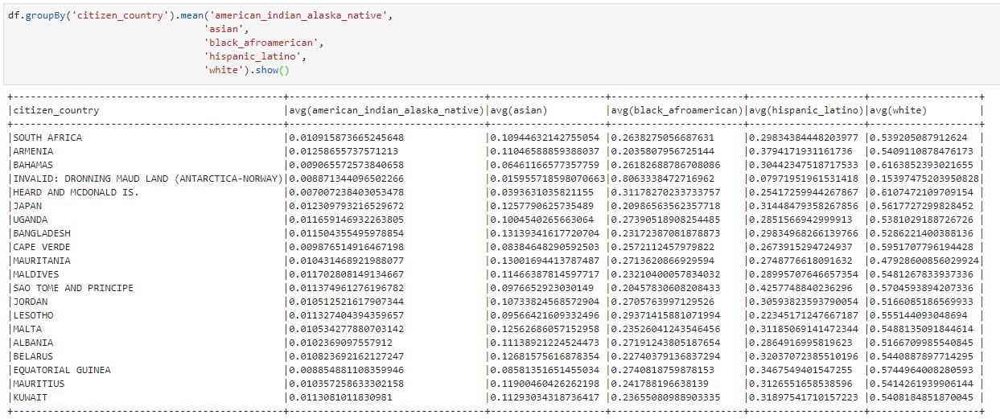

# Data Engineer Nanodegree - Capstone Project

## Project Summary

The aim of this project is to provide ready to read data from a variety of sources regarding US cities and immigration flow. In particular, all joins and transformations are done in ETL and users should be able to get insights without joining tables together. In fact, every table in the presentation layers is made thinking about the insight one could get directly from it if not by computations between columns. Furthermore, every code is translated to it's understandable meaning.

We give access to data that both immigrants and regulators could find useful in their decision making process. More in detail, users should be able to get info about:

- cities in US such as their geographical coordinates and in which State they are in. 
- airports, their corresponding city, position, international codes and many other .
- historical temperatures per city per year, per state. 
- demographics in each city, with population count and composition.
- the US immigrants and their info such as personal information, state of departure, citizenship and many others.
- the cities receiving immigration, to get insights about composition, how much immigration receives and so on. 

## Data Sources

Our sources reside in different locations, in different formats. They are continuously imported in S3 from which we draw them. They are:

- I94 Immigration Data: it come from the [National Travel and Tourism Office (NTTO)](https://www.trade.gov/national-travel-and-tourism-office);
- I94 Labels Data: which is a SAS file containing all the mappings relating the various codes in the previous dataset;
- Demographics Data: About demographic information per city in the USA. Comes from [here](https://public.opendatasoft.com/explore/dataset/us-cities-demographics/export/);
- World Temperatures: About temperature data around the world. Comes from [here](https://www.kaggle.com/berkeleyearth/climate-change-earth-surface-temperature-data);
- US Airports Data: About US airports. Comes from [here](https://datahub.io/core/airport-codes#data).

## Tools

- AWS S3: as data storage for raw, processed and presentation layer data. We opted for this kind of storage to provide:
  - Flexibility in acting on data;
  - High Availability;
  - Flexibility on schema design.
- AWS EMR: as data processing infrastructure. It's scalable and allows for heavy workloads using Spark;
- Python:
  - For data exploration using Pandas 
  - For processing using Spark

## Output Tables

#### Processed tables 

We get the processed tables from the raw data. They are somewhat cleaned and more understandable than their raw counterparts. But still not ready for quick and effective queries. 

- Airports
- Demographics
- Temperatures
- Immigration

#### Mappings tables

They come from the I94 Labels Data and undergone a radical transformation. Mainly used in joins to get eloquent values instead of codes.

- i94addrl: for state codes
- i95cntyl: for world country codes
- i94model: for modality of immigration codes
- i94prtl: for city codes
- I94VISA: for visa type codes

#### Presentation layers tables

They are the ready to query tables containing data in such a structure to allow some insight without joining tables.

Some of them are partitioned to make some aggregations faster. 

- Cities table: a table about cities and their info. Partitioned by `State`;
- Airports table: about airports and their corresponding city. Partitioned by `State` and `City`;
- Temperatures table: taken from a complex join (more on comments in the code). We get temperatures per city per year. Partitioned by `Year` and `State`;
- Demographics table: relating demographics. Partitioned by `State` and `Year`;
- Immigrants table: relating to the immigrants and their data in particular. Partitioned by `state_of_arrival` and `residence_country`;
- Immigration destination tables: relating to the cities receiving immigration. Partitioned by `residence_country` and `City`.

#### Data dictionary

Thus we can define a data dictionary as follows. As stated before, every table is ready to be queried and already derivation of several joins and manipulations. As stand alone tables, there is no really a relationship between them.

#### Sample query

This is an example of a query we can use. After getting this data, with the appropriate statistical tests, we can find evidence to support different theories about relationship between the country of origin and the population composition of the city of destination. This query comes from the table about destination demographics.

## How to set up and ETL

Simply complete `fill_this.cnf` with info about your S3 bucket and user. Remember that `AWS_S3_BUCKET` should be in the form of: `s3://yourbucketname/`

NB: create separate folder for raw, processed, mappings and presentation data. 

The ETL simply goes as follow:

- processes the labels and outputs the mappings
- processes the raw data and outputs the processed
- processes the processed and outputs the presentation layer data
- checks data

## Further Info

#### Data Update

Once the first batch of data is processed, data should be updated incrementally. The frequency should be monthly or yearly depending on the cost of getting this data.

#### Future Scenario to take in account

- **If data increases 100x** we can count on the scalability of EMR resources. We can also ponderate the actual use of partitioning even if loading incrementally would solve this issue partially.
- **If a run is needed on a daily basis** we could leverage AWS Lambda to run etl.py or build a robust pipeline using Apache Airflow.
- **If database is accessed simultaneously by 100+ connections** we can move the storing solution to Redshift or Cassandra depending on use cases. 

