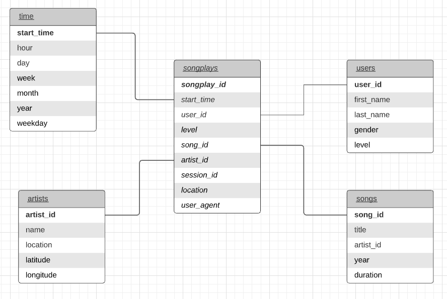

# Postgres DB Project

### Objective
An ETL pipeline is needed to analyze data relating to songs and user activity generated from a new music streaming app released by a startup. \
In the code a Postgres database is set up in order to store all the relevant data. It is extracted from JSON logs generated from user activity which also store metadata about songs in the user's app.\
In doing so, an ETL pipeline is also setup in order to extract the data and modelling it in order to load it in the DB and make it readily availavable for quick queries. 

### Database schema and ETL
The database is organized following a star schema where **songplays** table is the fact table and stores data about user activity collected from the logs.\
The dimension tables represent data about users (name, gender etc..), songs (title, artist etc..) and artists(name, location..). There's also a "time" table which enable to discriminate between different periods of time quickly in our queries.\
The ETL pipeline is built using python and its libraries for data modelling and communication with postgres. It takes as input the JSON documents relating logs and metadata and transforms it filtering the relevant data and preparing it for loading. Through SQL queries, it also creates the tables and insert values as it reads/prepares sequentially every document. 

### Repo
Here are present:
* crate_tables.py : run to reset table in DB
* etl.ipynb : instructions and code writing/testing
* test.ipynb : notebook used to check if table are correctly created and filled
* sql_queries.py : actual queries used in etl.ipynb and etl.py
* etl.py : the actual script, its code is partly taken from etl.ipynb after proper checking

### Use
Before running etl.py, run create_tables.py in order to create the relevant tables.\
create_tables.py imports objects from sql_queries.py, check also that out for changes or errors.\
Only then run etl.py to fill the tables with the actual data. 

